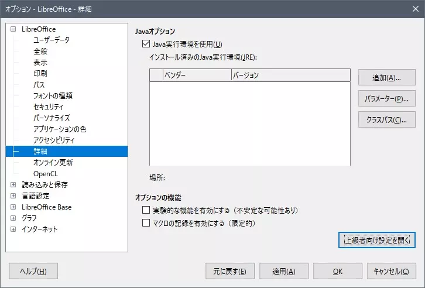
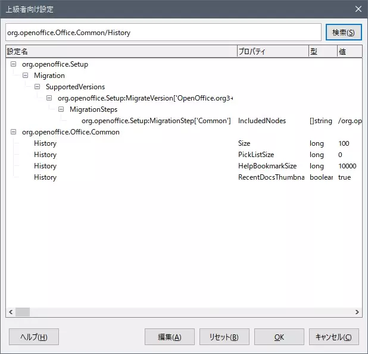

# LibreOffice の最近使用したドキュメントを表示しないようにする

LibreOfficeではアプリを起動し時に最近使用したドキュメントの一覧が表示されます。続きを作業するときには便利なのですが、すでに削除したファイルも表示されるので使い方によっては困ります。

特にファイルを保管場所から作業場所にコピーして作業し、作業が終わったら保管場所に戻すという使い方をしていると、最近使用したドキュメント一覧に表示されるのは既に削除されたファイルばかりで邪魔になります。

この履歴を保存しないようにするにはちょっと面倒な設定が必要だったのでメモを残しておきます。

まずはオプション設定画面から詳細項目を開き、「上級者向け設定を開く」ボタンをクリックします。

"`org.openoffice.Office.Common/History`" を検索し、 "`PickListSize`" を編集して値を "`0`" にします。

これで最近使用したドキュメントの履歴が保存されなくなり、一覧にも表示されなくなります。
